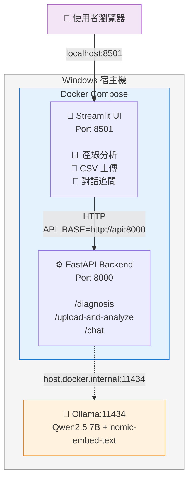
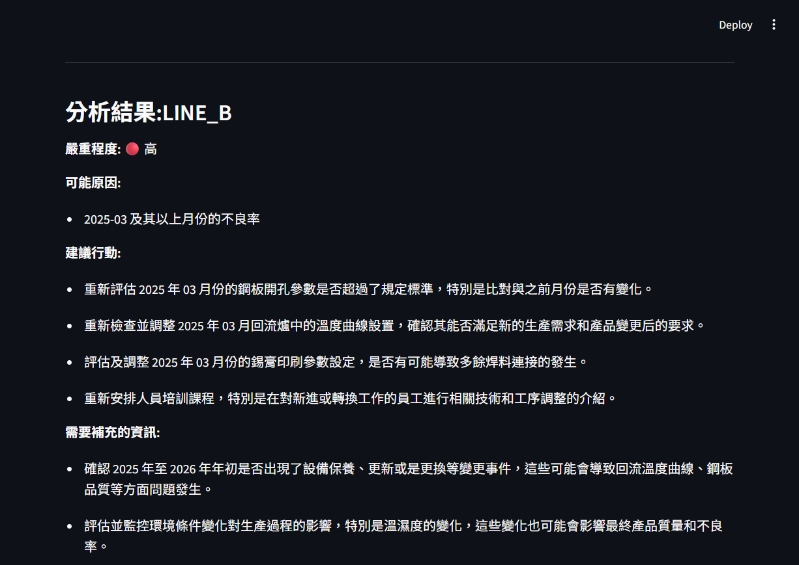
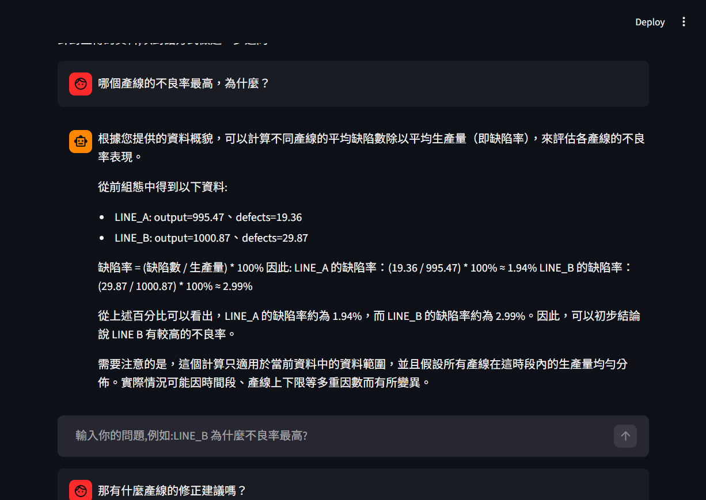
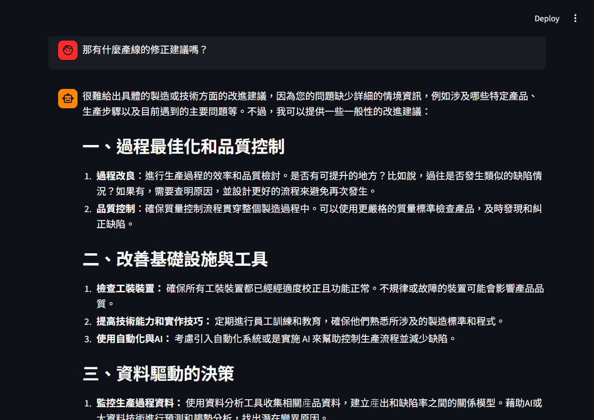
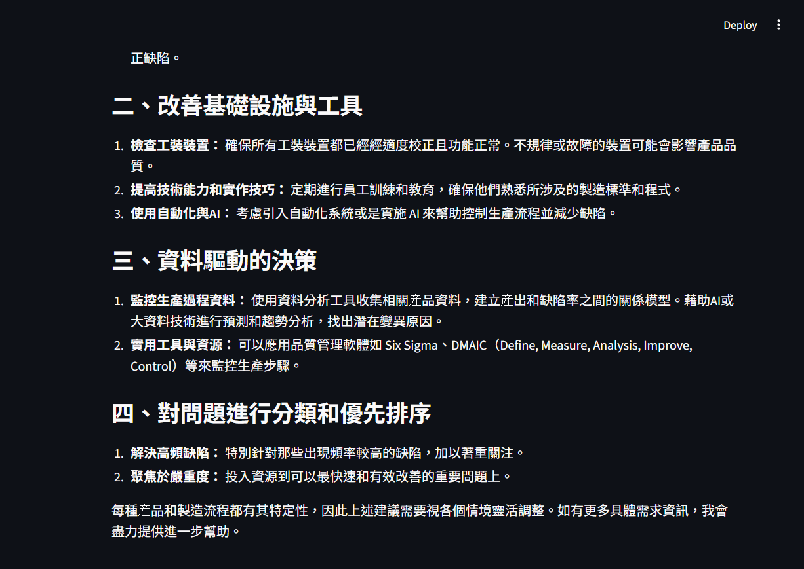
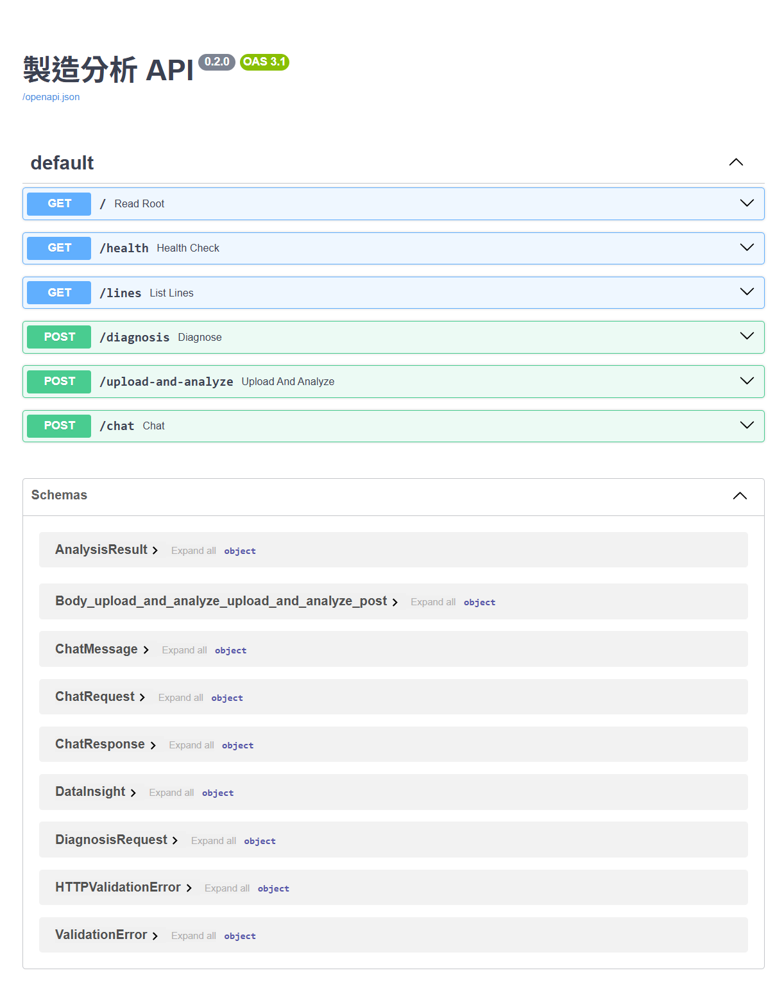

# 自然語言製造品質分析助手

> 用本地 LLM(Qwen2.5)實作的製造品質分析系統:既能分析既有產線資料,也能對任意上傳的 CSV 做多輪對話追問。整套以 RESTful API + Docker 容器化部署。

**核心特色**

- 🏭 **製造領域 RAG**:結合 SMT 缺陷知識庫(錫橋、假焊、立碑等),用向量檢索做語意匹配
- 📊 **任意 CSV 上傳**:自動探勘 + 類別欄分組統計,LLM 給出資料解讀建議
- 💬 **多輪對話追問**:無狀態 API + 對話歷史壓縮,讓使用者用自然語言深入分析
- 🛡️ **三層架構防禦**:Pydantic 嚴格驗證 + 重試容錯 + 優雅降級
- 🐳 **完整容器化**:Docker Compose 多服務、host.docker.internal 連宿主機 Ollama


## 系統能做什麼

三種使用情境,每種對應一種真實的資料分析需求:

1. **既有產線分析** — 從 SQL 撈不良率資料,讓 LLM 解讀並產生結構化的「可能原因 / 嚴重程度 / 建議行動」
2. **上傳資料分析** — 任意 CSV 上傳,系統自動探勘(整體統計 + 類別欄分組統計),LLM 給資料概要與分析建議
3. **多輪對話追問** — 針對上傳的資料用對話方式追問細節(「哪條線最差?為什麼?」、「那我該優先檢查什麼?」)

整套系統的設計核心是一句話:**確定性歸程式、機率性歸 LLM、邊界用 Pydantic 守**。SQL/pandas 算事實、LLM 解讀、Pydantic 嚴格驗證輸入輸出。


## 為什麼做這個專案

製造業在資料分析上面臨兩個現實挑戰:

1. **資料分析師資源不足以服務每位現場工程師** — 排隊等分析師寫 SQL/報表的時間,常常是現場真實問題等不到的時間
2. **資料外傳的法規與信任成本高** — 雲端 LLM 雖好,但企業真實顧慮是「製造數據能不能離開公司網路」

這個專案探索一條折衷路徑:**用本地 LLM(Ollama)讓現場工程師用自然語言提問、用 RAG 補足領域知識、用 Pydantic 守住 LLM 輸出的可信度邊界**。整個系統可以在企業內網部署、不依賴雲端 API、保有資料主權。

設計思路上的四個關鍵決定:

- **不直接做 NL2SQL**(自然語言轉 SQL):這條路風險高、結果不可控,LLM 生成的 SQL 可能語法錯、邏輯錯、暴露 SQL injection 漏洞。我選擇把 LLM 限縮在「**解讀已算好的事實**」這個更安全的角色——程式碼確定性地算事實,LLM 機率性地解讀。
- **本地部署 LLM**:Ollama + Qwen2.5 7B,回應企業對「資料不外傳」的真實顧慮——這對製造業特別重要,生產資料涉及商業機密與品質責任。
- **RAG 處理領域知識**:SMT 缺陷詞彙(錫橋、假焊、立碑等)讓 LLM 對製造情境有正確理解,而不只是依賴模型的通用知識。
- **完整容器化部署**:把「能在我電腦跑」變成「在任何環境都能跑」,符合企業真實部署的可重複性要求。


## 系統架構



**核心資料流**(四層架構,從具體到抽象):

1. **SQL / pandas 層** — 確定性地計算數值事實(不良率、月趨勢、分組統計)
2. **RAG 層** — 自適應檢索領域知識(相似度門檻過濾,有相關才用)
3. **LLM 層** — 解讀並產生結構化建議
4. **Pydantic 層** — 嚴格驗證 LLM 輸出(失敗自動重試、最終失敗回 503)

這四層對應整個系統的核心架構原則:**確定性歸程式、機率性歸 LLM、邊界用 Pydantic 守**。資料事實由前兩層保證精確,語言理解與建議生成交給 LLM,LLM 輸出再由 Pydantic 守住可預測性。


## 技術棧

| 層級 | 選擇 | 為什麼 |
|---|---|---|
| LLM 引擎 | Ollama + Qwen2.5 7B | 本地部署、無 API 成本、繁中表現佳、企業資料不外傳 |
| 向量嵌入 | nomic-embed-text(Ollama) | 同一個本地服務跑 LLM 和 embeddings,部署單純 |
| API 框架 | FastAPI | 自動產生 OpenAPI 文件、原生 Pydantic 整合、async 支援 |
| 資料驗證 | Pydantic v2 | LLM 輸出的「邊界守門」,自動驗證 + 自動文件 |
| UI 框架 | Streamlit | 快速做 ML demo 的標準工具,內建 `st.chat_message` 對話元件 |
| 資料層 | SQLite + pandas | 製造資料示範用 SQLite、通用 CSV 用 pandas |
| 容器化 | Docker + Compose | 應用層完整容器化、Ollama 留宿主機(理由見下方設計取捨) |
| RAG | 自實作向量檢索 | 知識庫小、刻意不上向量資料庫(理由見下方設計取捨) |
| 中文轉換 | OpenCC | 強制 LLM 輸出繁中(防止簡中混用) |


## 快速啟動

### 前置需求

- Docker Desktop(Windows / macOS)
- 8 GB+ VRAM 的 NVIDIA GPU(跑 Qwen2.5 7B 用,沒 GPU 可改用較小模型如 `qwen2.5:3b`)
- 32 GB+ 系統記憶體建議

### 1. 安裝 Ollama 並下載模型

從 [https://ollama.com](https://ollama.com) 下載安裝 Ollama,然後:

```bash
ollama pull qwen2.5:7b
ollama pull nomic-embed-text
```

**Windows 上需設定 Ollama 對容器開放**(否則容器連不到):

1. 控制台 → 系統 → 進階系統設定 → 環境變數
2. 新增系統環境變數:`OLLAMA_HOST` = `0.0.0.0`
3. 重啟 Ollama(系統列右下找 Ollama 圖示 → Quit → 再啟動)

驗證 Ollama 開放成功:

```bash
curl http://localhost:11434/api/tags
# 應該看到 qwen2.5:7b 和 nomic-embed-text 列出
```

### 2. 啟動服務

```bash
git clone <this-repo>
cd nl-data-assistant
docker compose up -d --build
```

第一次 build 約 1-2 分鐘(下載 base image、安裝依賴),之後 build 透過分層快取會快很多。

啟動完成驗證:

```bash
docker compose ps   # 兩個容器都應該是 Up
```

### 3. 開瀏覽器

- **使用者介面**:[http://localhost:8501](http://localhost:8501)
- **API 文件(Swagger UI)**:[http://localhost:8000/docs](http://localhost:8000/docs)

### 4. 確認可用

開瀏覽器到 8501,在 Tab 1「既有產線分析」選 LINE_B,按「執行 AI 分析」——大約 10-20 秒會看到結構化的 AI 分析結果。如果看到結果,代表 Ollama、API、UI 三層全部運作正常。

> ⚠️ **本機開發者注意**:若想直接用本機 venv 跑 Streamlit(例如想避開容器版的相容性議題,見「已知限制」段),啟動指令為 `streamlit run src/app.py --server.port 9501`(Windows 因為系統保留 port 範圍,可能要避開 8501)。


## 設計取捨

這段講「**我做的每個工程決定背後的理由**」——這比展示功能更接近真實的工程能力。

### 1. 為什麼不做 NL2SQL,而是讓 LLM 解讀已算好的事實?

**選項對照**:
- ❌ NL2SQL:使用者問「LINE_B 上個月不良率多少」→ LLM 生成 SQL 查資料庫 → 回答
- ✅ 本專案:程式碼用固定 SQL 算好「LINE_B 上個月不良率」 → LLM 解讀並給建議

NL2SQL 表面上更彈性,但生產級系統有三個致命問題:

- **SQL 正確性**:LLM 生成的 SQL 可能語法錯、邏輯錯(JOIN 條件漏了、GROUP BY 漏了),且**模型不會自己發現**
- **SQL 安全性**:LLM 可能生成包含 SQL injection 風險的查詢、無意間 DROP TABLE
- **結果驗證**:即使 SQL 跑出來,我們怎麼知道結果對?LLM 給出 100 萬營收和 1000 萬營收看起來都像對的——這需要另一層完整的「結果合理性檢查」

我選擇把「**算什麼**」交給程式碼(寫死 SQL/pandas 邏輯,人類審閱過)、把「**怎麼解讀算出來的東西**」交給 LLM。這讓系統可預測性大幅提升,**LLM 不能算錯,因為它根本沒在算**。

這是核心架構原則:**確定性歸程式、機率性歸 LLM、邊界用 Pydantic 守**。

### 2. 為什麼 Ollama 留在宿主機而非容器化?

技術上完全可以把 Ollama 容器化(`ollama/ollama` image 是現成的),但我刻意不這樣做,三個理由:

- **GPU 配置成本**:Windows 容器內配置 NVIDIA Container Toolkit 麻煩,容易踩 WSL2 + CUDA 環境的雷。為了「全部容器化」的整齊感而花一整天搞 GPU 直通,投報率太低。
- **資源型服務 vs 應用服務的本質差異**:Ollama 是「載入 7B 模型到 VRAM 的穩定基礎設施」,不該頻繁重啟。把它和「會經常 rebuild 的應用容器」綁在一起是錯誤的部署模式。應用容器隨意 rebuild、Ollama 不受影響,系統穩定性大幅提升。
- **貼近企業真實部署**:真實企業會把 GPU 模型服務獨立部署在 GPU 伺服器(或 vLLM/Triton),應用容器透過網路連——我的架構直接對應這個模式。如果未來要把這套搬到企業內網,只需把 `LLM_BASE_URL` 環境變數從 `host.docker.internal:11434` 改成那台 GPU 伺服器的位址,**程式碼一字不改**——這正是「設定與程式碼分離」原則的兌現。

「**不做**」這個決定,反而比「全部容器化」更接近資深工程師的判斷。

### 3. 為什麼用自實作的向量檢索而非向量資料庫(Chroma / Qdrant / Pinecone)?

知識庫只有 4 段(錫橋、假焊、立碑、通用診斷原則),用向量資料庫是殺雞用牛刀:

- **啟動時把所有 embeddings 算出來快取在記憶體**(`_KB_CACHE`),檢索就是用 numpy 算餘弦相似度
- **沒有額外的服務要部署、沒有額外的相依、沒有額外的維運成本**
- **效能足夠**:4 段知識的線性掃描,單次查詢小於 1 ms,加上 embedding 本身的 100-200 ms,使用者完全感受不到差別

但我清楚規模擴大後的演進路徑:

- **超過幾百段** → 換 FAISS(本地、極快、無服務相依)
- **超過幾千段** → 換 Chroma 或 Qdrant(支援增量更新、版本管理、跨集合查詢)
- **企業級多租戶** → 換 Pinecone 或 Weaviate(支援分片、ACL、雲端託管)

「**現在不上、但知道何時該上、為什麼**」是工程判斷力的具體展現,而不是「我們公司很厲害,什麼都用最新最炫的工具」。

### 4. 為什麼多輪對話 API 是無狀態(stateless)?

**選項對照**:
- ❌ 有狀態 API:API 內部維護 `{session_id: ChatSession}` dict,前端只送 `session_id + 新問題`
- ✅ 本專案:每次 `/chat` 請求,前端送**完整對話歷史**,API 處理完就忘了

無狀態設計的優勢:

- **可水平擴展**:多開一台 API 容器、任意分流請求,因為它們都不依賴前一個請求的記憶。負載均衡器隨意把請求丟給任何一台,都能正確處理。
- **重啟不丟對話**:狀態在前端 session_state,API 重啟對話還在
- **無 session 管理負擔**:不用處理 session 過期、清理、跨容器同步等
- **符合 RESTful 原則**:無狀態是 REST 架構的核心約束

代價:每次請求 body 變大(整段歷史要送),但對話歷史通常幾 KB 規模,網路成本可忽略。

**這呼應整個專案的另一個原則**:**LLM 沒有記憶、記憶是工程做出來的**。同樣的思維延伸到 API 層——API 也不該有記憶,記憶由呼叫方主動帶。**兩層架構,同一個哲學**。

### 5. 為什麼 RAG 是「自適應」?

RAG 不是無條件啟動——每次檢索後看相似度分數,**只有超過門檻(0.4)的知識才塞進 prompt**:

- 對「製造資料」查詢 → 「錫橋」「假焊」相似度高 → 啟用 RAG
- 對任意 CSV(可能是電商銷售、人事資料)查詢 → 相似度低 → 跳過 RAG

設計理由:**低相關的知識比沒有知識更糟**——它會變成 prompt 雜訊,讓 LLM 在不該應用領域知識的場合誤用它。例如使用者上傳「銷售資料」,如果 RAG 強行塞入「焊接溫度曲線」進 prompt,LLM 可能會試圖把不相干的概念硬套上去。

「**有判斷地用 RAG**」比「**有 RAG 就一直用**」進階一個層次。生產級 RAG 系統幾乎都有這層自適應判斷。

### 6. 為什麼類別欄偵測用「排除型」而非「列舉白名單」?

**第一版(踩雷)**:
```python
if c["dtype"] in ("object", "category", "bool")  # 列舉白名單
```

實際上 pandas 對文字欄的 dtype 顯示可能是 `"object"`、`"str"`、`"string"`(視來源和版本而異)。列舉白名單漏一個,功能就完全失效。

**第二版(穩健)**:
```python
if c["name"] not in numeric_col_names  # 排除黑名單(不是數值欄就考慮)
```

「**不是數值欄就考慮**」這個邏輯本質更穩定——pandas 未來新增 dtype 也不會破壞我們的判斷。這是「**白名單脆弱、排除法穩健**」的設計慣性:當變動性高時,反過來定義邊界更可靠。


## 核心功能展示

### 1. 既有產線分析(SQL + LLM)

從 SQLite 撈三條產線的不良率資料、選一條(例如 LINE_B 不良率異常),系統用 SQL 計算月趨勢、由 LLM 解讀並產生結構化建議——含可能原因、嚴重程度、建議行動、需要補充的資訊。



**技術重點**:

- **SQL 確定性事實**:不良率、月趨勢由 SQL 算,不交給 LLM 推測
- **Pydantic 結構化驗證**:LLM 輸出失敗自動重試(最多 3 次),連續失敗回 503 並降級
- **OpenCC 強制繁中**:防止 LLM 在繁簡中亂用、確保使用者看到一致的繁中輸出
- **嚴重程度自動視覺化**:🔴 高 / 🟡 中 / 🟢 低,讓使用者一眼判斷優先序

### 2. 任意 CSV 上傳分析(pandas + 自適應 RAG)

上傳任意 CSV,系統用 pandas 自動探勘——整體統計、類別欄分組統計(自動偵測唯一值少的文字欄)、樣本列。RAG 自動判斷:有相關領域知識才用、沒有就跳過,避免雜訊污染分析。

**技術重點**:

- **類別欄自動偵測**:用「**排除型**判斷」(不是數值欄就考慮)而非列舉白名單,對未知 dtype 也兼容
- **自適應 RAG**:相似度低於 0.4 自動跳過,避免雜訊
- **三層防禦**:副檔名 → 大小(10 MB) → 解析錯誤,fail-fast 順序由便宜到貴
- **API 端的狀態碼語意精準**:400(檔案類型/解析錯)、413(過大)、503(LLM 暫時掛)、500(未預期錯)各自對應不同失敗類型

### 3. 多輪對話追問(無狀態 API + 對話歷史壓縮)

上傳資料後,可用對話方式追問。例如針對製造資料問:

**第一輪**:「**哪個產線的不良率最高,為什麼?**」

LLM 引用分組統計(LINE_A `defects=19.36`、LINE_B `defects=29.87`)算出 1.94% vs 2.99%、結論明確指向 LINE_B。



**第二輪**:「**那有什麼產線的修正建議嗎?**」

LLM 結合第一輪的上下文,給出結構化的多層建議——過程最佳化、基礎設施改善、資料驅動決策、優先排序。





**技術重點**:

- **無狀態 API**:對話歷史由前端維護、隨每次請求帶來,符合 RESTful 原則
- **每輪重新 RAG**:用「最新使用者問題」當查詢,讓 RAG 跟上對話脈絡(第一輪檢索「不良率」、第二輪檢索「修正建議」)
- **自動歷史壓縮**:超過 10 筆訊息時把舊歷史用 LLM 摘要成 system message,保留最近 4 輪原文,避免 context 無限膨脹
- **第 1 輪資料注入,後續靠歷史**:`data_profile_text` 只在第 1 輪 system 帶,後續輪靠對話歷史中 assistant 提過的內容維持資料意識

### 4. API 端點(Swagger UI 自動文件)

FastAPI 從 Pydantic 模型自動生成完整 API 文件,所有端點 / 結構 / 狀態碼一目了然。Swagger UI 還能直接在頁面上測試 API(`Try it out` 按鈕),不用另外裝 Postman。



| 端點 | 方法 | 用途 |
|---|---|---|
| `/` | GET | 服務狀態檢查 |
| `/health` | GET | 健康檢查(K8s liveness probe 用) |
| `/lines` | GET | 列出所有產線的不良率 |
| `/diagnosis` | POST | 對指定產線做 LLM 分析 |
| `/upload-and-analyze` | POST | 上傳 CSV + pandas 探勘 + LLM 解讀 |
| `/chat` | POST | 多輪對話(無狀態) |


## 踩坑與排查方法論

這個專案的真實成本,不在於「會寫多少程式」,而在於「**程式跑起來但行為不對時,能不能找出真因**」。這段紀錄我做這個專案撞到的關鍵踩坑、學到的排查紀律。

### 紀律一:錯誤訊息只是症狀,真因要靠分層定位

**案例**:Streamlit 容器版的上傳功能出現 `AxiosError: Request failed with status code 400`。

直覺反應是「我 API 寫錯了,回了 400」——但我先**精確分層**檢查每一層的證據:

- `docker compose logs ui` → **乾淨**,沒有任何 Python 例外
- `docker compose logs api` → **沒收到任何 `/upload-and-analyze` 請求**
- 瀏覽器 DevTools → console 顯示 `Unrecognized deltaType: 'undefined'`

這三條證據組合起來定位出真因:**問題既不在 API、也不在後端 Python**,而是**瀏覽器 ↔ Streamlit 容器**這一層出問題——Streamlit 內部 protobuf 序列化在這個容器配置下有怪行為。

評估了多輪修法假設都不對之後,我選擇了「**核心 API 完整容器化、Streamlit 在本機 venv 跑**」的混合架構,把容器化 UI 議題寫入已知限制——而非繼續陷入無止盡的猜測式 debug。

> **教訓**:錯誤訊息(`AxiosError 400`)只是症狀,真正的根因常常隔了好幾層。靠 logs、DevTools 分層定位,才看得到真因。**「分層定位」是 web 應用排查的核心技巧**——明確區分「瀏覽器 ↔ Streamlit」、「Streamlit ↔ FastAPI」、「FastAPI ↔ Ollama」三層,各自看 log,問題在哪層立刻浮現。

### 紀律二:Docker image 是「凍結時光膠囊」,改 code 必須 `--build`

**案例**:加完 `/chat` 端點後,容器版的 `/docs` 怎麼樣都不顯示新端點。

我以為是 import 錯誤——加了 debug print、找不到問題。直到我注意到 `docker ps` 顯示容器 STATUS 是「**Up 2 days**」——這是 build 時間,不是啟動時間。我才意識到:`docker compose up -d`(沒 `--build`)只是啟動既有 image,**沒重新打包我的程式碼**。

容器是 image 的執行實例,image 在 build 那一刻定格了當下的程式碼;之後本機修改不會自動進入容器。修法是明確 `docker compose up -d --build`,讓 build 流程把新程式碼打進新 image。

> **教訓**:`docker compose up -d` 只啟動既有 image;改 code 後必須 `docker compose up -d --build` 才會把改動進到新 image。**「邏輯上連得起來,但物理上對不上」是部署問題的常見特徵**——以為新 code 上線了,實際還是舊版在跑。

### 紀律三:「Windows 保留 port」跟「port 被占用」是兩個錯

**案例**:`streamlit run src/app.py` 在本機跑出 `WinError 10013 嘗試存取通訊端被拒絕`,而且試了 100 個 port 都失敗。

直覺以為是「8501 被佔用」——但測 `netstat -ano | findstr 8501` 顯示沒有任何程序在用。實際是 **Windows 系統動態保留了一段 port range** 給 Hyper-V/WSL 用,即使沒人在用也不允許一般使用者綁定。

用 `netsh interface ipv4 show excludedportrange protocol=tcp` 看保留範圍,改用 9501 立刻解決。

> **教訓**:`WinError 10013 Permission Denied` 跟 `Address already in use` 是兩種不同的錯,從錯誤訊息精準區分,才不會排錯方向。**保留 port** 和**被占用 port** 在表面都是「綁不上」,但解法完全不同——前者要避開保留範圍,後者要找出占用程序。

### 紀律四:「狀態累積」造成的怪 bug,從頭來最快

**案例**:容器版 Streamlit 多次重 build 後出現各種怪現象——上傳失敗、有時又好、白屏。

我和指導者試了多個方向(版本問題、debug log 干擾、PYTHONPATH 設定)都沒徹底解決。直到我下定決心:

```bash
docker compose down
docker system prune -f    # 清掉懸空 image、build cache
docker compose up -d --build
```

**問題消失了**。真因可能是:某次失敗 build 留下的中間狀態、舊 image layer、cache 中的奇怪設定組合——任何一個都可能引起怪行為。

> **教訓**:某些 Docker 怪 bug 真因不在 code 而在累積的狀態。**「核選項排查法」(完整清理 + 重建)** 雖然不優雅但極實用——把這列為工程實務上的「沒救時的最後一步」。但也別一上來就用核選項——應該先嘗試精準排查,核選項只在「精準排查多輪都失敗」時用。

### 紀律五:LLM 給齊資料 ≠ 模型會用對資料

**案例**:加完類別欄分組統計後,LLM 還是從「樣本前 5 列」推估、忽略分組平均。

第一個假設是「LLM 看到了但不用」(LLM 的 token 注意力偏好)——但我先拿證據驗證。執行 `build_data_situation(explore_dataframe(df))` 直接看輸出,發現「按類別欄分組的數值統計」這段**完全沒出現**——LLM 根本沒看到分組資料,我之前的「LLM 看到但不用」假設完全錯誤。

真因是條件判斷:
```python
if c["dtype"] in ("object", "category", "bool")   # 列舉白名單
```

但 pandas 對從 SQLite 讀進來的文字欄,dtype 字串顯示為 `"str"`——不在我列舉的白名單裡,所以判斷失敗、`group_summaries` 永遠空。

修法是把判斷從「**列舉白名單**」改成「**排除型**」(不是數值欄就考慮)——更穩健、對 pandas 未來新增 dtype 也兼容。

> **教訓**:寫條件判斷時不要憑記憶猜資料長什麼樣,要拿真實值驗證。**驗證測試結果時,要找「我預期該出現的關鍵變化」、不是看「熟悉的東西在不在」**。看到輸出有「資料前幾列範例」這種熟悉內容就以為功能正常,是測試紀律不夠的表現——應該明確找「新加的分組統計那段」在不在。

### 紀律六:LLM 的「複述偏好」現象

**案例**:LLM 對結構化的資料概貌(統計摘要)常常用「換句話說」的方式複述,而非做出有洞察的分析。

我在這個專案兩次撞到這個現象:
1. RAG 階段:LLM 把知識庫條列重述一遍
2. 資料分析階段:LLM 把統計摘要換句話說一次(「output 範圍從 900 到 1100,平均接近 1000」幾乎是 `min=900, max=1100, mean=998.24` 的同義改寫)

**這個現象的本質**:當給定的 context 已經是結構化的事實,模型最低成本的「看似合理」回應就是「把事實複述一遍」——不會錯,但也沒洞察。

**緩解方向**:在 prompt 裡明確指示「**請不要複述統計摘要,直接給出『主要觀察』和『分析建議』**」,強化「**做什麼具體推理**」的引導。

> **教訓**:給 LLM context ≠ 引出洞察,中間還隔一道「**要求它做什麼具體推理**」的 prompt 設計。這是 LLM 工程的核心難題之一,不是接上 LLM 就會分析。


## 已知限制

誠實列出目前的能力邊界——清楚自己沒做到的,比假裝完美更接近真實的工程現場。

### 1. 容器版 Streamlit 上傳功能有相容性議題

容器化 Streamlit 1.57 + file_uploader 在某些情境出現 `AxiosError 400`,根因疑似在 Streamlit 內部 protobuf 序列化層。**核心 API(`/upload-and-analyze`)在容器內運作正常**,使用 `test_chat.py` 等 Python 客戶端可完整測試。建議在本機 venv 跑 Streamlit、API 在容器跑(混合架構)——這也對應企業真實部署中「應用容器化、UI 通常另案」的常見模式。

### 2. LLM 對「對話歷史中的具體數字」記憶不可靠

多輪對話下,LLM 對「歷史 assistant 訊息」中的精確數字複述會有微幅誤差(例如把 2.98% 記成 2.68%),且**錯誤會跨輪累積**——一旦錯誤被寫進 assistant 的回答、留在歷史裡,後續輪次會把這個錯誤當事實繼續推論。

**緩解方向**:重要決策應對照原始資料驗證、或在每輪重新提供權威數字。**生產級系統若依賴 LLM 精確記住數字,應該在每輪重新把「權威數字」注入 context,不能只依賴對話歷史**。

### 3. 通用 CSV 探勘只算整體 + 分組統計,沒有衍生指標

如「不良率 = defects / output」這種衍生指標,需要 LLM 自己做除法——而 LLM 算術不可靠(常見小數點誤差、會把缺陷數誤稱為缺陷率等)。

**進階做法**:讓 LLM 自己決定要對 DataFrame 做什麼 pandas 操作(Agentic Analytics 模式),系統執行 LLM 生成的 pandas 程式碼、把確定的結果塞回 prompt——這需要另一層完整工程(運算正確性、結果驗證、安全沙箱)。

### 4. RAG 知識庫小、用自實作向量檢索

僅 4 段製造領域知識,啟動時建索引快取於記憶體。**超過幾百段應換 FAISS,超過幾千段該換 Chroma/Qdrant**——我清楚演進路徑,但目前規模不需要。

### 5. 沒做認證 / 授權 / 用量限制

純粹的功能展示,沒有 OAuth、JWT、rate limiting 等生產級安全機制。生產級部署應加入這些。

### 6. 單元測試覆蓋不足

目前主要靠手動 + Pydantic 守邊界。生產級應補 pytest 為核心邏輯(SQL 算式、build_situation、retrieve、analyze_validated)做迴歸測試。


## Future Work

以下是若繼續演進,我會走的下一階段:

### 短期(1-2 週)

- **Agentic Analytics**:讓 LLM 自己決定要對 DataFrame 做什麼 pandas 操作,解掉「衍生指標」問題
- **單元測試**:用 pytest 為核心邏輯做迴歸測試
- **更智慧的對話歷史壓縮**:目前固定門檻(10 筆)觸發,可改成「依 token 數動態判斷」
- **錯誤情境的整合測試**:模擬 Ollama 掛掉、CSV 壞檔、超大檔案等情境,驗證錯誤處理鏈

### 中期(1-2 月)

- **向量資料庫**:知識庫規模成長後從自實作換成 Chroma/Qdrant、加入版本管理
- **OAuth + 用量配額**:接入企業 SSO、按使用者限流
- **生產級 UI**:用 React + TypeScript 重寫前端,讓 Streamlit 的容器化議題不再影響使用者體驗
- **LLM 輸出快取**:對相同問題快取 LLM 結果,減少不必要的計算成本

### 長期方向

- **多資料源整合**:從上傳 CSV 擴展到直接連企業資料庫(SAP、MES、ERP)
- **報表自動生成**:每天 / 每週自動產出產線健康報告、異常自動告警
- **LLM Observability**:接入 LangSmith 或 Helicone 監控 LLM 用量、品質、失敗率、回應時間分布
- **多模型路由**:依任務複雜度選用不同模型(簡單摘要用小模型、複雜分析用大模型),平衡成本與品質


## 專案結構

```
nl-data-assistant/
├── src/
│   ├── api.py              # FastAPI 服務:/diagnosis, /upload-and-analyze, /chat
│   ├── app.py              # Streamlit 三 Tab 介面
│   ├── llm_client.py       # LLM 連線、Pydantic 模型、analyze_validated/analyze_dataset
│   ├── analyzer.py         # SQL 分析:get_line_defect_rates, build_situation
│   ├── data_explorer.py    # pandas 探勘:整體統計 + 類別欄分組 + 樣本
│   ├── retriever.py        # 關鍵字 RAG 檢索(舊版,保留作對照)
│   ├── vector_retriever.py # 向量語意 RAG 檢索(實際使用)
│   ├── make_data.py        # 產生 SQLite 假資料(三條產線 90 天不良率)
│   └── main.py             # 整條鏈 CLI 測試
├── knowledge/
│   └── defect_kb.md        # RAG 知識庫:錫橋、假焊、立碑、通用診斷原則
├── docs/
│   └── screenshots/        # README 用截圖
├── Dockerfile              # api 服務的 image
├── Dockerfile.streamlit    # ui 服務的 image
├── docker-compose.yml      # 多服務編排
├── entrypoint.sh           # 容器啟動腳本(自我初始化 SQLite)
├── requirements.txt        # Python 依賴(開發環境快照)
├── .env.example            # 環境變數範例
├── .gitignore
└── README.md
```


## 核心依賴

- Python 3.13
- FastAPI(API 框架)
- Streamlit 1.57+(UI 框架)
- Pydantic 2.x(資料驗證)
- pandas(資料探勘)
- OpenAI Python SDK(透過 Ollama 提供的 OpenAI 相容 API)
- OpenCC(繁中強制轉換)
- numpy(向量檢索的數學運算)

完整依賴見 `requirements.txt`(開發環境快照,生產部署建議用 `pip-compile` 鎖更穩定的版本範圍)。


## 授權

MIT License


---

*這個專案的核心設計理念是「**確定性歸程式、機率性歸 LLM、邊界用 Pydantic 守**」——好的 LLM 應用不是把所有東西塞給 LLM,而是清楚劃分「機器該做的、LLM 該做的、邊界該守的」,讓系統的可預測性和靈活性同時兼顧。*